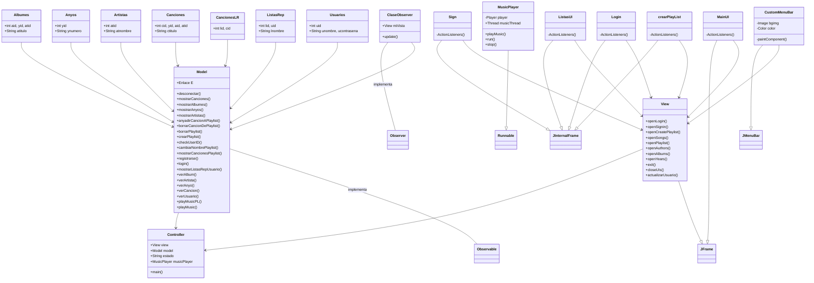
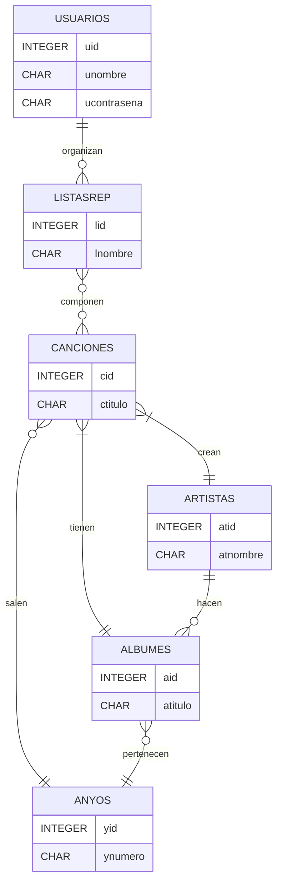
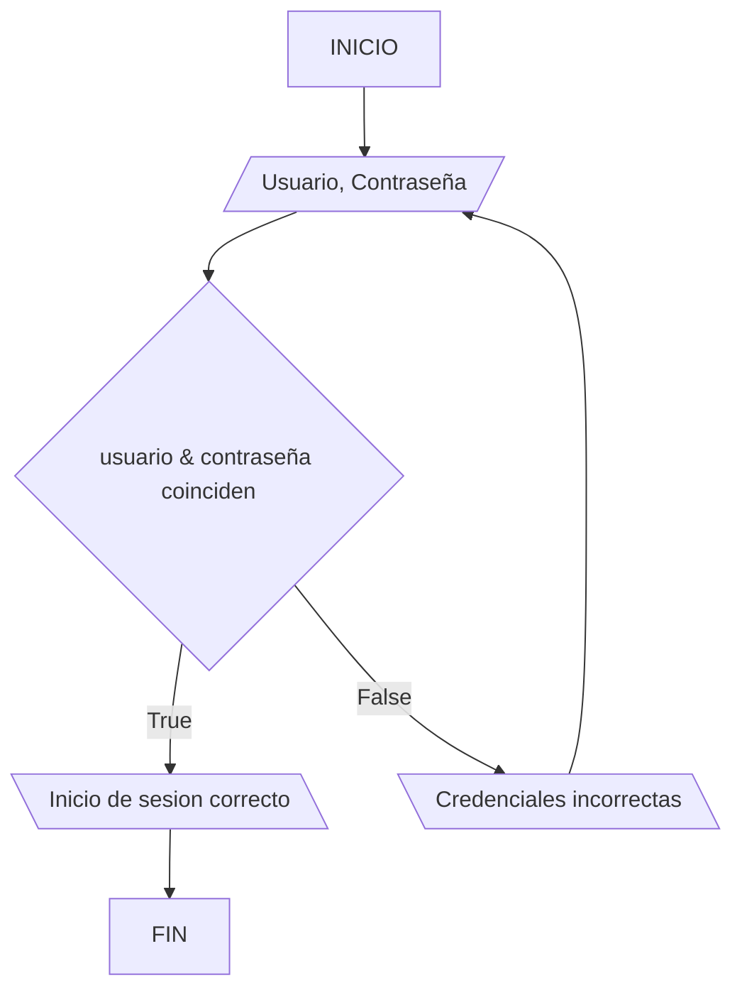
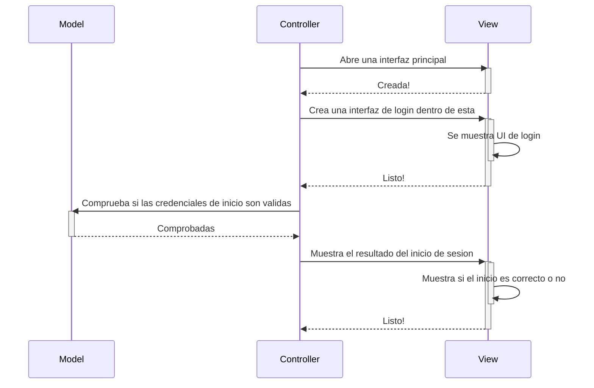
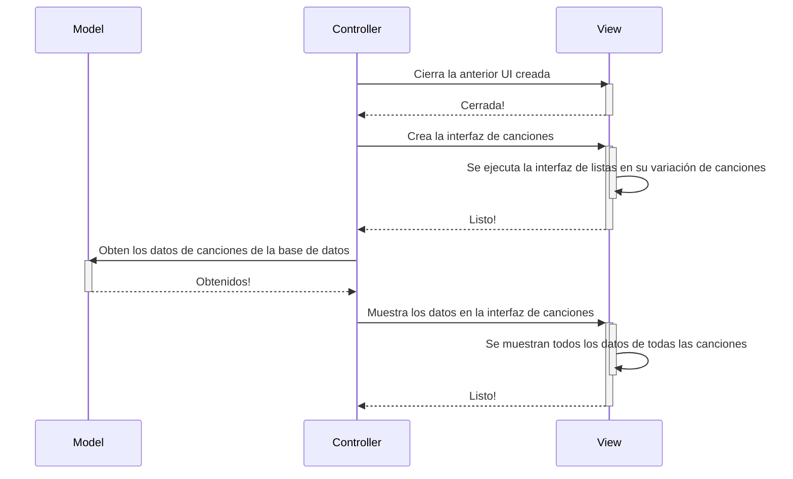

---

### ¿Qué es Spochofy?

##### Spochofy es un gestor y reproductor de música creado en Java, usando bases de datos SQLite. En es Spochofy podrás:

+ Buscar canciones según su titúlo.
+ Revisar que canciones han creado tus artistas favoritos.
+ Crear tus propias playlist personalizadas.
+ Buscar canciones y albumes por su año de creación.
+ Y otras varias utilidades para que puedas disfrutar de tus canciones favoritas.
---
### Como comenzar a usar Spochofy

- Lo primero al comenzar a usar Spochofy es crearte una cuenta usando el boton Sign In que veras en la primera interfaz, una vez introduzcas tus nuevas credenciales, te veras devuelto a Log In, donde podras usar tu nueva cuenta para Iniciar Sesión y empezar a gestionar tu musica.
- Cuando tengas tu sesion iniciada veras que puedes acceder a todas las canciones disponibles en Spochofy y reproducirlas, o acceder a Listas De Reproduccion, para crearlas, para ello deberas introducir el nombre que desees darle a tu nueva PlayList y presionar el boton de Crear PlayList.
- Finalmente puedes añadir canciones a la PlayList haciendo click en las canciones y tu nueva PlayList, y listo, ya puedes reproducir tu PlayList!
---

### Diagramas y explicaciones

#### Diagrama de clases:

---
### Información para colaboradores

#### Issues:

-Interfaz grafica: DONE

-Base de datos: DONE

-Reproducción de musica: DONE

#### TODO

-Primera versión del programa

---
### Ramas del proyecto

##### Las ramas usadas son:

+ Main: Solo para releases (Versiones funcionales del proyecto).
+ Development: Rama del desarrollo, usada para hacer merge al trabajo de los desarolladores antes de pasarlo a main, esta rama se usa tambien para actualizar readme y parecidos
+ Ramas de cada desarrollador: Ramas unicas de los desarroladores

---
### Diagrama de base de datos

---

### Diagramas de flujo por funciones

#### Inicio de sesión:

#### Crear la UI usada para mostrar canciones

