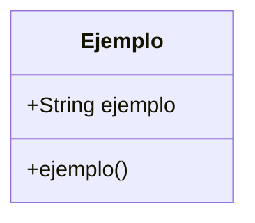
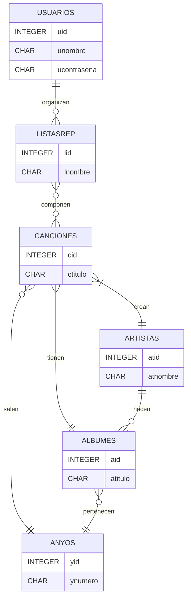

# Spochofy

---

### ¿Qué es Spochofy?

##### Spochofy es un gestor y reproductor de música creado en Java, usando bases de datos SQLite. En es Spochofy podrás:

+ Buscar canciones según su titúlo.
+ Revisar que canciones han creado tus artistas favoritos.
+ Crear tus propias playlist personalizadas.
+ Buscar canciones y albumes por su año de creación.
+ Y otras varias utilidades para que puedas disfrutar de tus canciones favoritas.
---
### Como comenzar a usar Spochofy

---

### Diagramas y explicaciones 

#### Diagrama de clases:

---
### Información para colaboradores

---
### Ramas del proyecto

##### Las ramas usadas son:

+ Main: Solo para releases (Versiones funcionales del proyecto).
+ Development: Rama del desarrollo, usada para hacer merge al trabajo de los desarolladores antes de pasarlo a main, esta rama se usa tambien para actualizar readme y parecidos
+ Ramas de cada desarrollador: Ramas unicas de los desarroladores

---
### Diagrama de base de datos

